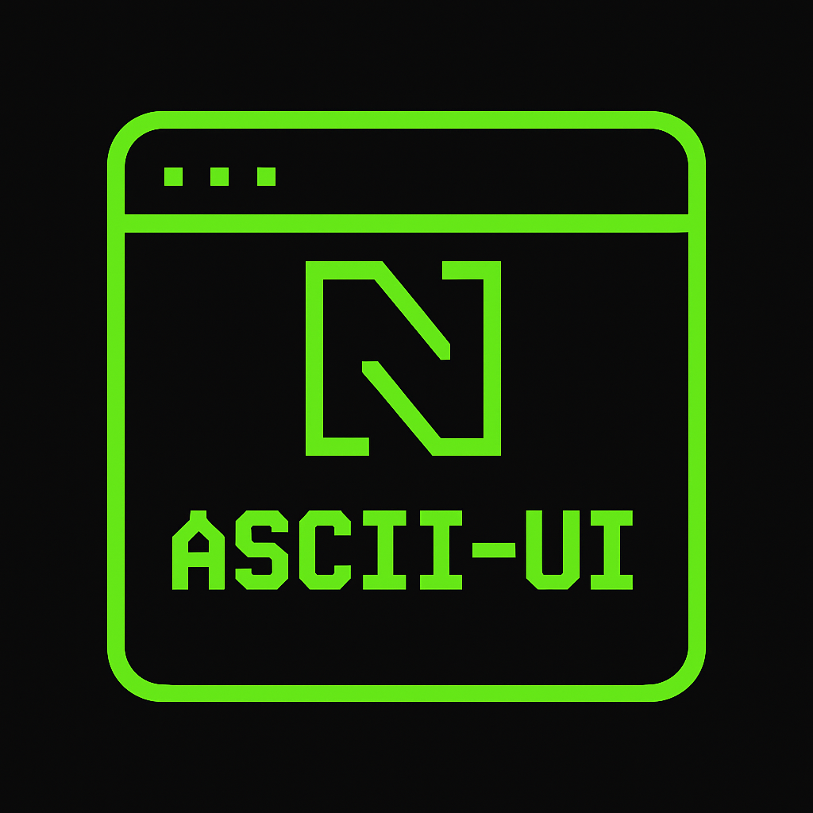

# ascii-ui.nvim

A WIP extensible ui framework with no non-sense apis (hopefully) for nvim.

```lua
return {
  { 
  "rcasia/ascii-ui.nvim", 
  opts = {}
 },
}
```

## API example

```lua

local ui = require("ascii-ui")
local Paragraph = ui.components.Paragraph
local Button = ui.components.Button
local useState = ui.hooks.useState

local App = ui.createComponent("App", function()
  local content, setContent = useState("initial content")
  return {
   Paragraph({ content = content }),
   Button({
    label = "change",
    on_press = function()
     setContent("changed content")
    end,
   })
  }
end)

ui.mount(App)

```

## 🔹 Minimal Example

<p align="center">
  
</p>


<details>
<summary>📜 See code snippet</summary>

```lua
local ui = require("ascii-ui")
local Paragraph = ui.components.Paragraph
local Column = ui.layout.Column
local Row = ui.layout.Row
local Button = ui.components.Button
local useState = ui.hooks.useState

local App = ui.createComponent("App", function()
	local content, setContent = useState("initial content")
	local count, setCount = useState(0)

	return Column(
		Paragraph({ content = "📝 " .. content }),
		Row(
			Button({
				label = "[ Change Text ]",
				on_press = function()
					setContent("content changed at " .. os.date("%H:%M:%S"))
				end,
			}),
			Button({
				label = "[ +1 Counter ]",
				on_press = function()
					setCount(count + 1)
				end,
			})
		),
		Paragraph({ content = "🔢 Counter: " .. count })
	)
end)

ui.mount(App)
```

</details>

