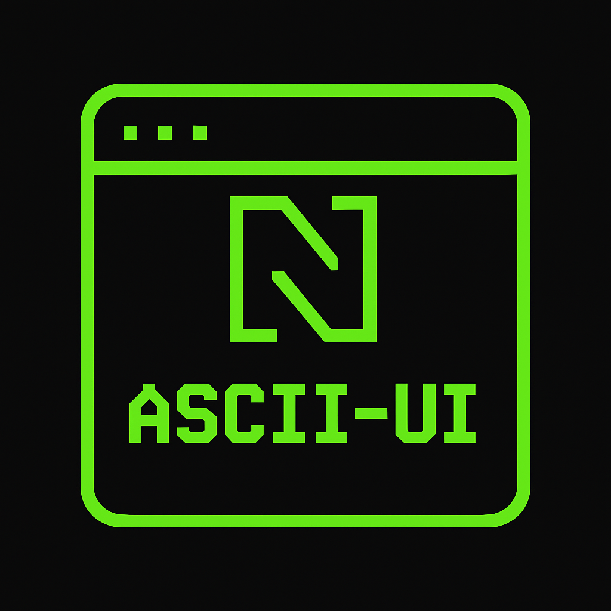

[](https://github.com/rcasia/ascii-ui.nvim/actions/workflows/test.yml)
[](https://github.com/rcasia/ascii-ui.nvim/actions/workflows/publish-to-luarocks.yml)
[](https://github.com/rcasia/ascii-ui.nvim/actions/workflows/check-docs.yml)

# ascii-ui.nvim

A WIP extensible ui framework with no non-sense apis (hopefully) for nvim.

check out the [docs](https://rcasia.github.io/ascii-ui-docs/) to learn more.

## AI Agent Skill

Use ascii-ui.nvim with AI coding agents (OpenCode, Claude, etc.) by installing the official agent skill:

```sh
npx skills add rcasia/agent-skills --skill ascii-ui-nvim
```

The skill gives agents a mental model of the component system, hooks, and common patterns so they can generate correct ascii-ui code without hallucinating APIs. Source: [rcasia/agent-skills](https://github.com/rcasia/agent-skills).

## Agentic Development

Since August 8, 2026, this project is developed using a multi-agent system. The codebase is maintained by specialized AI agents that collaborate on development:

- **ascii-ui-dev**: Primary development agent specialized in the framework's React-like component model and Neovim integration
- **nvim-docs-researcher**: Read-only agent that searches Neovim API documentation
- **convention-reviewer**: Read-only agent that validates code against project conventions
- **agent-teacher**: Meta-learning agent that continuously improves the other agents by capturing discoveries

See [AGENTS.md](./AGENTS.md) for details on the agent system and `.opencode/agents/` for agent definitions.

## Development

### Setup

1. Clone the repository:
   ```bash
   git clone https://github.com/rcasia/ascii-ui.nvim.git
   cd ascii-ui.nvim
   ```

2. Install dependencies:
   - [lux](https://github.com/lux-cli/lux) (Lua package manager)
   - [stylua](https://github.com/JohnnyMorganz/StyLua) (Lua formatter)
   - [luacheck](https://github.com/lunarmodules/luacheck) (Lua linter, via lux)
   - [pre-commit](https://pre-commit.com/) (git hooks framework)
   - [yq](https://github.com/mikefarah/yq) (YAML processor, for workflow validation)

3. Install pre-commit hooks:
   ```bash
   pre-commit install --hook-dir .githooks
   ```

   This sets up automatic checks (formatting, linting, docs validation, tests) on every commit.

### Common Commands

| Command | Purpose |
|---|---|
| `make test` | Run full test suite |
| `make check` | Run lint, format check, docs check |
| `make docs` | Regenerate vimdocs from Lua annotations |
| `make debug` | Live-reload debug session |
| `pre-commit run --all-files` | Run all pre-commit hooks manually |

<table align="center">
  <tr>
    <td></td>
    <td></td>
  </tr>
  <tr>
       <td></td>
       <td></td>
  </tr>
</table>

# Installation

```lua
return {
  { 
  "rcasia/ascii-ui.nvim", 
  opts = {}
 },
}
```

## Usage

```lua

local ui = require("ascii-ui")
local Paragraph = ui.components.Paragraph
local Button = ui.components.Button
local useState = ui.hooks.useState

local App = ui.createComponent(function(props)
  local content, setContent = useState("initial content")
  return {
   Paragraph({ content = content }),
   Button({
    label = "change",
    on_press = function()
     setContent("changed content")
    end,
   })
  }
end)

ui.mount(App)

```

## Live Reload (Experimental)

> **Experimental:** This feature is under active development and the API may change.

ascii-ui.nvim ships a live-reload debug mode that lets you iterate on your UI without leaving the terminal. Save any `.lua` file in the plugin and the running Neovim instance automatically tears down the current UI, unloads all `ascii-ui` modules, and re-executes your script from scratch.

**Requirements:** `nvim` on `$PATH`.

### Quick start

1. Write your component in any `.lua` file and return it:

```lua
-- lua/myplugin/MyComp.lua
local ui = require("ascii-ui")
local useState = ui.hooks.useState
local Paragraph = ui.components.Paragraph
local Button    = ui.components.Button

return ui.createComponent("MyComp", function()
  local count, setCount = useState(0)
  return {
    Paragraph({ content = "count: " .. count }),
    Button({ label = "+1", on_press = function() setCount(count + 1) end }),
  }
end)
```

2. Create a `debug.lua` in the repository root (it is git-ignored) that points at it:

```lua
require("ascii-ui").debug("lua/myplugin/MyComp.lua")
```

3. Start the session:

```sh
make debug
# or
./scripts/debug
```

Every time you save any `.lua` file under `lua/` or `debug.lua` itself, the UI reloads automatically. Errors are shown as Neovim notifications without crashing the session.

`ui.debug` also works from any running Neovim session without `make debug`:

```
:lua require("ascii-ui").debug("lua/myplugin/MyComp.lua")
```

### How it works

| File / API | Role |
|---|---|
| `ui.debug(file)` | Loads the component file with `dofile`, mounts it, and returns the `bufnr` |
| `lua/ascii-ui/dev/init.lua` | Live-reload module — watches the plugin directory, debounces events, unloads modules, re-runs `debug.lua` |
| `scripts/debug-init.lua` | Minimal Neovim init used for the debug session (no user config loaded) |
| `scripts/debug` | Shell launcher — resolves paths, exports env vars, opens Neovim |
